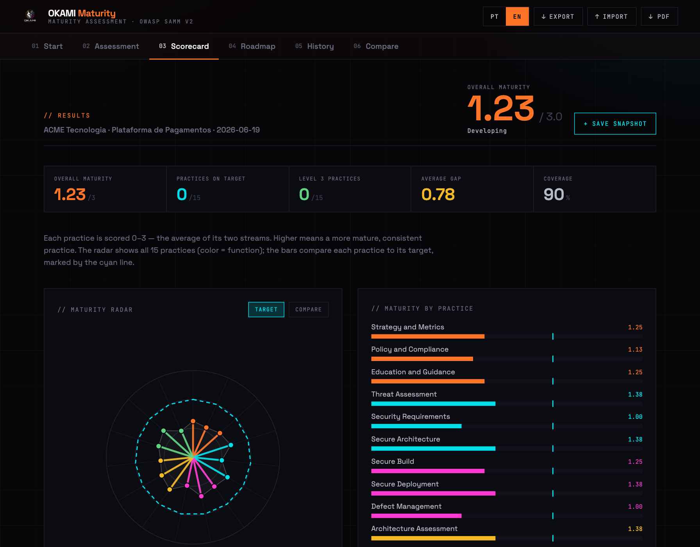
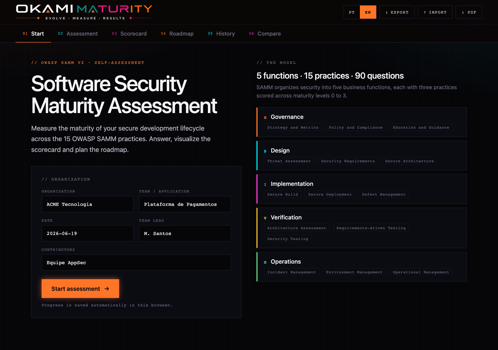
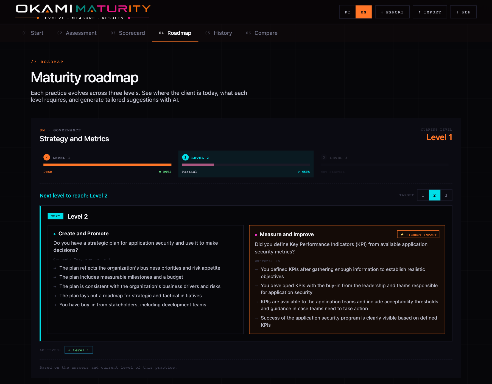
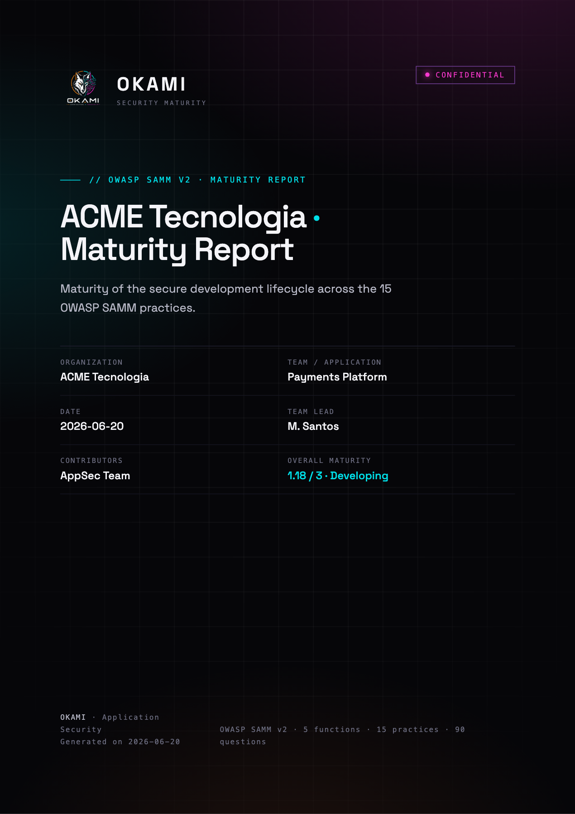
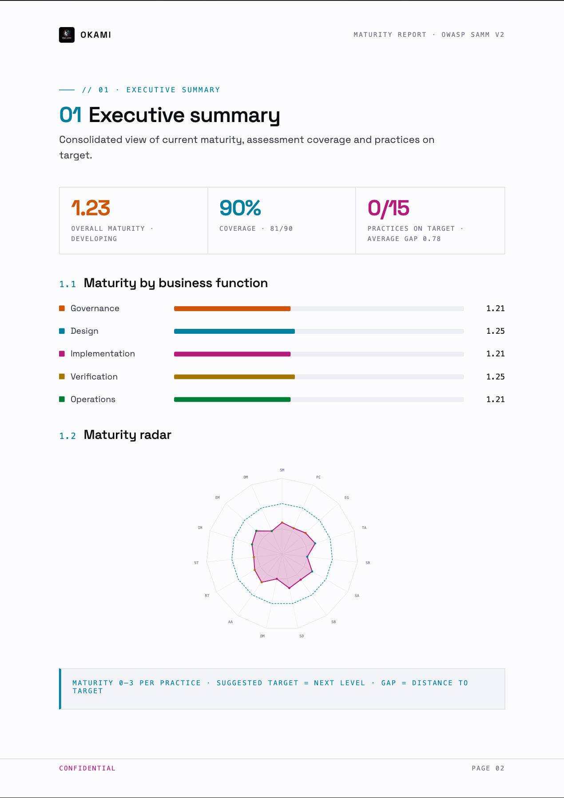
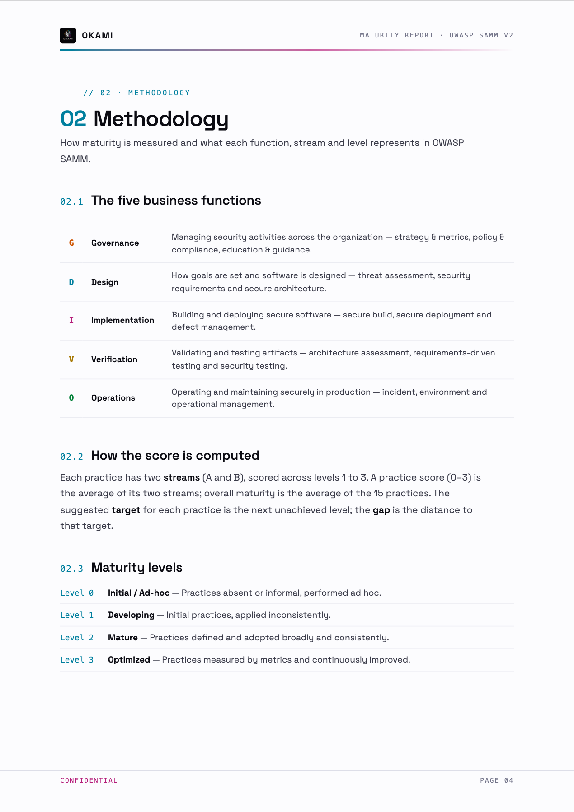
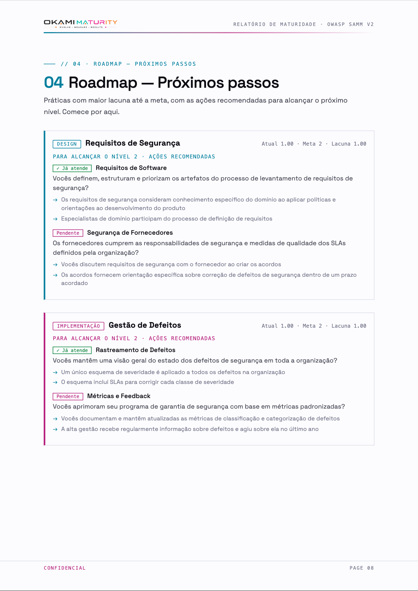

<!-- Language: **English** · [Português](README.pt-BR.md) -->

# Okami SAMM

> 🌐 **English** · [Português (Brasil)](README.pt-BR.md)

**OWASP SAMM v2 security maturity assessment** by Okami — measure the maturity of
a secure development lifecycle across **5 business functions · 15 practices · 90
questions** (English/Portuguese), visualize the scorecard, plan the roadmap and
export a polished, Okami-branded PDF report.

<p align="center">
  
</p>

---

## ✨ Features

- **Guided assessment** — 90 OWASP SAMM v2 questions across two streams (A/B), levels 1–3, with interview notes per question.
- **Live scorecard** — overall maturity, per-function and per-practice scores, a maturity radar and on-target KPIs.
- **Roadmap** — current level, gap to target and the next level to reach for every practice, with optional AI-tailored suggestions.
- **History & compare** — save snapshots and track maturity evolution over time.
- **SQLite persistence** — save client assessments on the server, list them, reload and re-report.
- **Okami-branded PDF** — a multi-page report: cover, contents, executive summary, methodology, per-function findings, prioritized roadmap with concrete actions, maturity evolution (when snapshots exist), conclusion and an assessment-notes appendix.
- **Bilingual** — full English/Portuguese UI and reports.
- **AI-operable (MCP + ACP)** — AI agents read **and operate** the system over **MCP** (HTTP + stdio) and both **ACP** protocols (Agent Communication + Agent Client): create assessments, answer questions, score, plan and report.
- **Self-contained** — React is vendored locally; the app renders even offline / behind CSP.

---

## 📸 Screenshots

|  |  |
|---|---|
|  |  |
| **Setup & scope** — define the client/team and read the SAMM model. | **Roadmap** — gaps, next level and tailored actions per practice. |

---

## 📄 The PDF report

A 9-page document following the "OKAMI · Security Assessment Report" visual
identity (Space Grotesk, cool-white paper, per-function brand accents):

| | |
|---|---|
|  |  |
| **Cover** — dark, brand gradients, scope metadata. | **01 Executive summary** — metrics, by-function bars, maturity radar. |
|  |  |
| **02 Methodology** — the 5 functions, scoring, levels 0–3. | **04 Roadmap** — priority practices with recommended actions. |

Full structure (sections adapt to the data — evolution and appendix appear only when relevant):

- **Cover** (dark, brand gradients) + **Contents** (with page numbers)
- **01 Executive summary** — metrics, by-function bars, maturity radar
- **02 Methodology** — the 5 functions, how the score is computed, levels 0–3
- **03 Maturity by function** — per-practice tables with strength/attention analysis
- **04 Roadmap — Next steps** — priority practices with **recommended actions** derived from the SAMM criteria/guidance (no AI required)
- **05 Maturity evolution** — overall trend across saved snapshots (when ≥1 snapshot)
- **06 Conclusion** — interpretation, immediate priorities and a recommendation
- **Appendix** — interview notes by practice (when notes were taken)

---

## 🚀 Quick start

```bash
npm install
npx playwright install chromium      # downloads Chromium once, for the PDF
cp .env.example .env                 # adjust port / AI key if you want
npm start                            # http://localhost:3000
```

Without an AI key the app works normally — only the Roadmap's AI suggestions stay hidden.

```bash
npm test    # tests/offline-render.js — the app must render with the CDN blocked
```

---

## 🧩 How it works

```
            Cloudflare Pages                         Container (Render/Railway/Fly/VPS)
┌─────────────────────────────────┐        ┌──────────────────────────────────────────┐
│  public/  (static SAMM app)      │        │  Express                                   │
│  • React vendored (no CDN)       │        │  • /api/assessments  → better-sqlite3      │
│  • app-bridge.js  ──────────────────┐     │  • /api/report.pdf   → Playwright/Chromium │
│  functions/api/[[path]].js  ──proxy─┼────▶│  • /api/ai/suggest   → OpenAI/Anthropic    │
└─────────────────────────────────┘   /api/*└──────────────────────────────────────────┘
```

- **Frontend** — the standalone Design Canvas app (`public/`); React (dc-runtime) boots on its own. It keeps a draft in `localStorage` and talks to the API through `public/app-bridge.js`. React/ReactDOM are **vendored** in `public/vendor/` (no runtime CDN).
- **Backend** — Node + Express + `better-sqlite3`. Scoring (`server/score.js`) mirrors the frontend so the server can build reports from the saved state.
- **PDF** — Playwright (headless Chromium) renders `server/report/render.js` to an A4 PDF.
- **AI (optional)** — a multi-provider proxy; the AI button only shows when a key is configured.

---

## 🔌 API

| Method | Route | Purpose |
|---|---|---|
| GET | `/healthz` | health check |
| GET | `/api/config` | `{ aiEnabled, aiProvider, version }` |
| GET | `/api/assessments` | list saved assessments |
| POST | `/api/assessments` | create (`{ state }`) → assessment |
| GET | `/api/assessments/:id` | full state |
| PUT | `/api/assessments/:id` | update (`{ state }`) |
| DELETE | `/api/assessments/:id` | delete |
| GET | `/api/assessments/:id/report.pdf` | Okami PDF of the assessment |
| POST | `/api/report/preview.pdf` | PDF from a raw `state` (without saving) |
| GET | `/api/backup` | download a JSON backup of **all** assessments |
| POST | `/api/restore` | restore a backup (`{ assessments, mode: merge\|replace }`) |
| POST | `/api/ai/suggest` | AI proxy (`{ messages }`); 503 when disabled |

`state` is the app's full state (`meta`, `answers`, `notes`, `targets`,
`snapshots`, `lang`).

### In-app toolbar

The floating toolbar (bottom-right) has **＋ New** (start a fresh assessment),
**☁ Save** (create/update on the server), **📂 Load** (list & restore) and
**📄 PDF report** (Okami PDF of the current assessment). The top **PDF** button
also produces the Okami report. The Load dialog also has **⤓ Backup** / **⤒ Restore**
to export/import all your data.

During the assessment you can answer by **keyboard**: `0–3` answers the focused
question and advances, `↑/↓` move, `←/→` switch practice, `⌫` clears.

---

## 🤖 AI (multi-provider, optional)

The Roadmap suggestions work with any provider configured via env
(`server/ai.js`). The AI button only appears when a key is present.

| Provider | Variables |
|---|---|
| OpenAI | `AI_PROVIDER=openai` · `AI_MODEL=gpt-4o-mini` |
| Minimax / OpenAI-compatible | `AI_PROVIDER=openai` · `AI_BASE_URL=https://.../v1` · `AI_MODEL=...` |
| Anthropic | `AI_PROVIDER=anthropic` · `AI_MODEL=claude-sonnet-4-6` |
| Anthropic with custom URL | `AI_PROVIDER=anthropic` · `AI_BASE_URL=https://your-proxy/anthropic` |

`AI_API_KEY` is the chosen provider's key. (User-delegated OAuth — OpenAI/Minimax
— is a future item; today the config is key + custom URL.)

---

## 🔌 MCP — let AI agents operate the system

The whole system is exposed over **MCP** (Model Context Protocol), so an AI client
(Claude, etc.) can read **and operate** it: discover the SAMM model, create an
assessment, answer questions (e.g. from an interview transcript), set targets,
read the scorecard/roadmap, snapshot progress and generate the PDF report.

Two transports, same tools:

- **HTTP** (remote) — mounted at `POST /mcp` (Streamable HTTP). Point any MCP client at `https://your-instance/mcp`.
- **stdio** (local) — `node server/mcp-stdio.js`, operating the same SQLite DB (`DB_PATH`).

**Claude Code:**

```bash
claude mcp add --transport http okami-samm https://your-instance/mcp        # remote
claude mcp add okami-samm -- node /abs/path/okami-samm/server/mcp-stdio.js   # local
```

**Claude Desktop** (`claude_desktop_config.json`):

```json
{
  "mcpServers": {
    "okami-samm": {
      "command": "node",
      "args": ["/abs/path/okami-samm/server/mcp-stdio.js"],
      "env": { "DB_PATH": "/abs/path/okami-samm/data/okami-samm.db" }
    }
  }
}
```

**Tools:** `get_samm_model`, `list_assessments`, `get_assessment`,
`create_assessment`, `set_answers`, `set_targets`, `set_notes`, `get_scorecard`,
`get_roadmap`, `add_snapshot`, `generate_report`, `delete_assessment`,
`export_backup`, `import_backup` (+ a `samm://model` resource).

> The MCP endpoint has **full read/write** access (same as the REST API). If you
> expose `/mcp` to the internet, put it behind a reverse proxy with auth / a VPN.

## 🤝 ACP — agent interoperability

Beyond MCP, the system also speaks both protocols called **ACP** (same operations
underneath, in `server/operations.js`):

**Agent *Communication* Protocol** (REST, agent-to-agent) — mounted at `/acp`:

```bash
curl http://localhost:3000/acp/agents                    # discover the samm-operator agent
curl -X POST http://localhost:3000/acp/runs -H 'content-type: application/json' -d '{
  "agent_name": "samm-operator",
  "input": [{ "parts": [{ "content_type": "application/json",
              "content": "{\"tool\":\"create_assessment\",\"args\":{\"org\":\"ACME\"}}" }] }] }'
```

The run completes synchronously; the output message carries the JSON result.
`{"tool":"help"}` lists the available tools.

**Agent *Client* Protocol** (Zed, JSON-RPC over stdio) — `node server/acp-client-stdio.js`.
In Zed's `settings.json`:

```json
{
  "agent_servers": {
    "Okami SAMM": {
      "command": "node",
      "args": ["/abs/path/okami-samm/server/acp-client-stdio.js"],
      "env": { "DB_PATH": "/abs/path/okami-samm/data/okami-samm.db" }
    }
  }
}
```

Drive it with `/<tool> {args}` commands (e.g. `/create_assessment {"org":"ACME"}`,
`/help`) or, when an AI provider is configured, with plain natural language — the
agent runs an LLM tool-calling loop over the SAMM operations.

## 🗄️ Database

SQLite at `DB_PATH` (default `./data/okami-samm.db`, created automatically, WAL
mode). Tables: `assessments` and `snapshots` (see `server/db.js`).

---

## 🏠 Self-host (one command)

The whole app (frontend + API + PDF + SQLite) runs from a single container:

```bash
docker compose up -d        # → http://localhost:3000
```

Your data lives in **`./data/okami-samm.db`**. Back it up by copying that folder,
or with the in-app **⤓ Backup** button (Load dialog) / `GET /api/backup`; restore
with **⤒ Restore** / `POST /api/restore`. If you expose the instance to the
internet, put it behind a reverse proxy with auth / a VPN (a single-password gate
can be added on request).

## ☁️ Deploy — Cloudflare Pages (frontend) + container (backend)

Static frontend on **Cloudflare Pages** + Node backend (API + PDF) in a
**container** behind Cloudflare's CDN. Pages serves `public/` and a Pages Function
(`functions/api/[[path]].js`) proxies `/api/*` to the backend — same-origin, no CORS.

**1. Backend (container).** Any Docker host (Render / Railway / Fly.io / VPS). The
image already bundles Playwright's Chromium; the `/data` volume persists SQLite.

```bash
docker build -t okami-samm .
docker run -p 3000:3000 -v okami_samm_data:/data \
  -e AI_PROVIDER=openai -e AI_API_KEY=...   # optional
  okami-samm
```

Render has a ready blueprint (`render.yaml`). You end up with a URL, e.g.
`https://okami-samm.onrender.com`.

**2. Frontend (Cloudflare Pages).**

```bash
npx wrangler pages deploy                    # uses wrangler.toml (output dir = public/)
npx wrangler pages secret put BACKEND_URL    # = https://okami-samm.onrender.com
```

Or set `BACKEND_URL` via **Pages → Settings → Variables**.

> No-Cloudflare alternative: the container itself serves the frontend at `/`, so
> `docker run` alone is a complete deploy.

---

## 📁 Structure

```
server/    Express, SQLite, scoring, AI proxy and PDF generation
  operations.js      single source of truth for all operations (MCP + ACP share it)
  mcp.js + mcp-stdio.js          MCP server (tools/resources) + stdio entry
  acp-comm.js                    Agent Communication Protocol (REST, /acp)
  acp-client.js + acp-client-stdio.js   Agent Client Protocol (Zed, stdio)
  data/samm.json     OWASP SAMM model (extracted from the app)
  report/            render.js (Okami HTML) + pdf.js (Playwright) + styles.js + fonts.css
public/    standalone SAMM app + app-bridge.js + vendor/ (React)
functions/ Cloudflare Pages Function (/api/* proxy)
tests/     offline-render regression test
docs/      design spec + screenshots
data/      SQLite database (gitignored)
```

---

## 📦 Origin

Imported from `Projeto Avaliação OWASP SAMM.zip` (Claude Design, project
`d202c418-...`). The app's React/dc-runtime code was not rewritten — only
packaged and extended through the bridge (`app-bridge.js`) and the backend.

## License

Proprietary — © Okami. All rights reserved.
